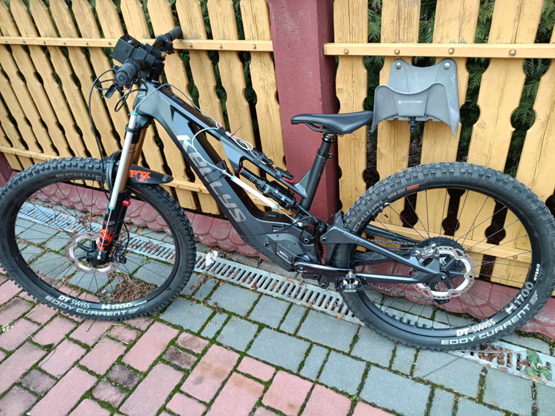
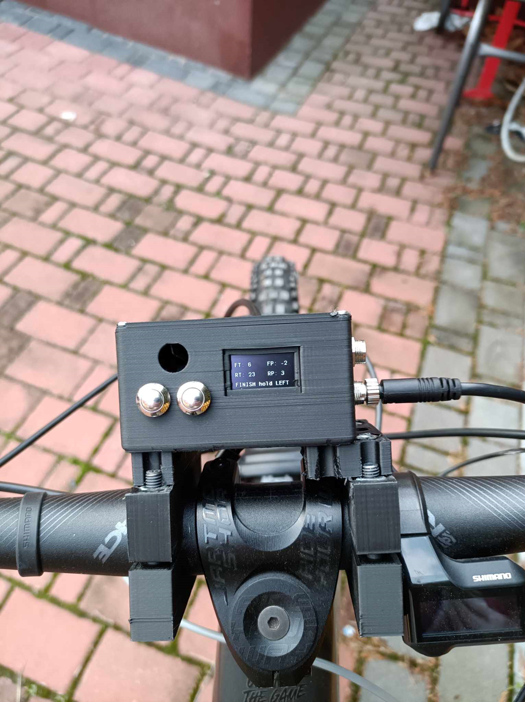
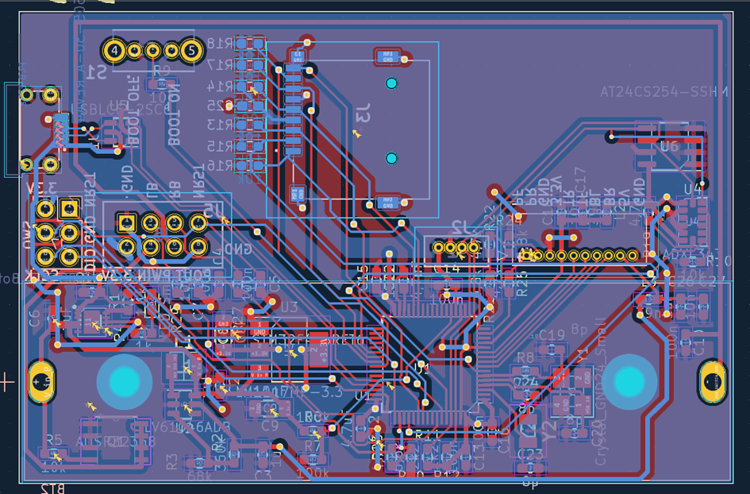
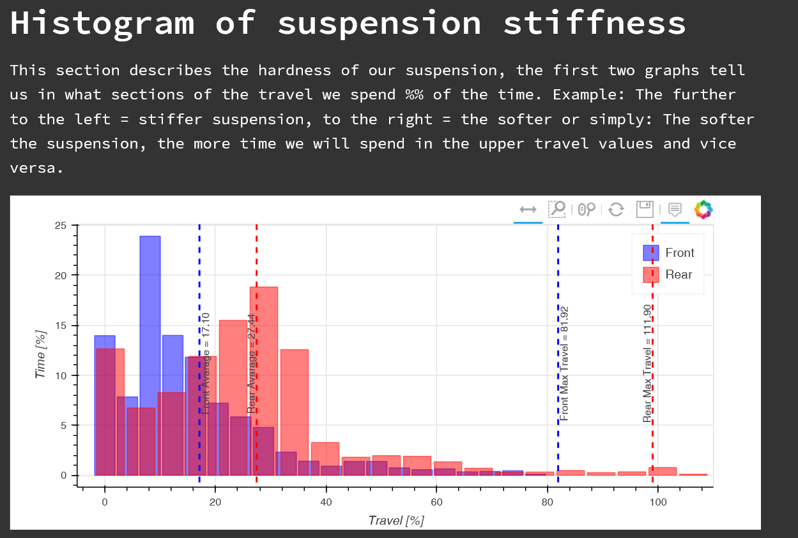
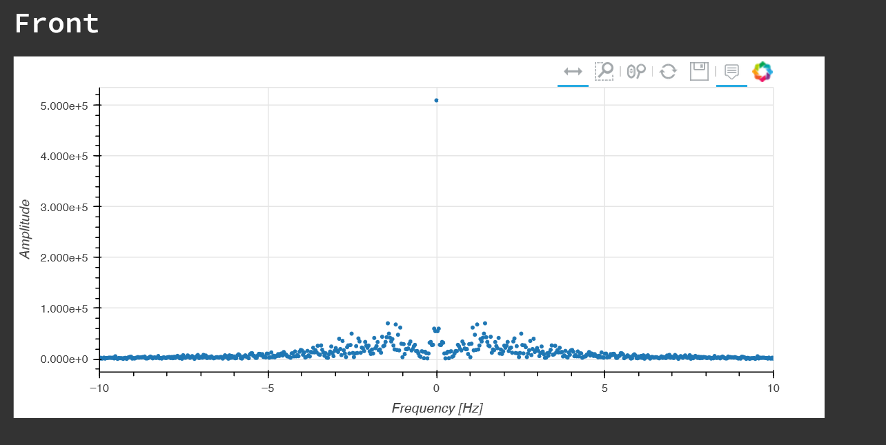
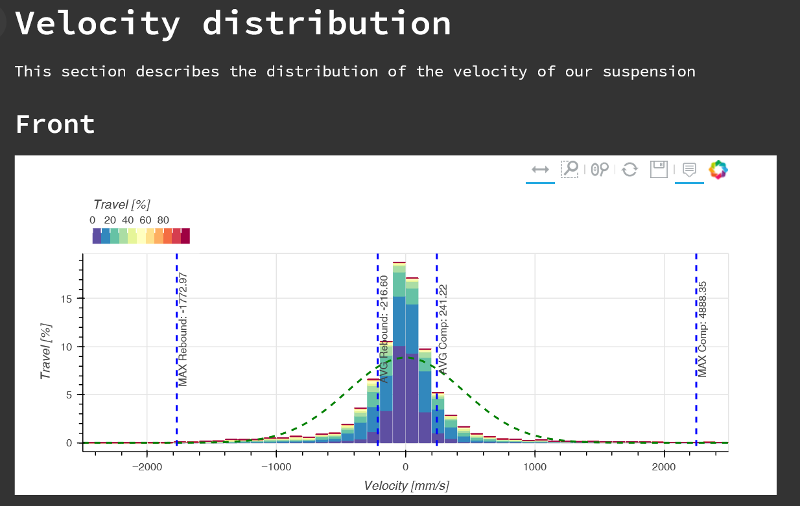
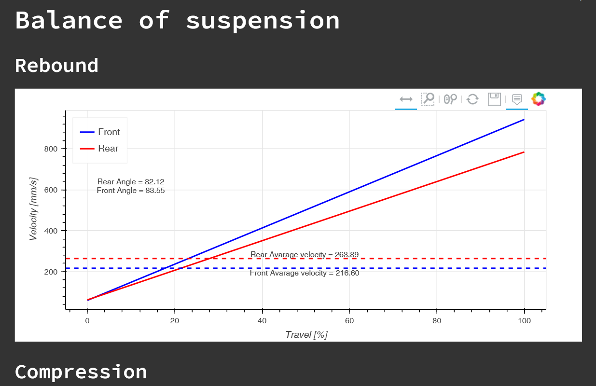

# data_acquisition_module

The project consists in creating a system for testing suspension work and suggesting better settings. I love extreme cycling so came up with the idea out of passion and curiosity :)

The general concept of the idea, the embedded part:
- Using linear potentiometers will take place the main travel measurement
- Pressure sensors will monitor suspension progression
- Brake force measurment (using tensometers) for Braking statistics (not suported yet on GUI)
- The accelerometer will monitor overloads for a given setting,
- Recording of measurement data on the sd card
- LCD menu with buttons
- IOT (maybe)
- PCB project
- Enclosure
  
The most interesting part, data science:
- Setting up the server using the python streamlit and bokeh library
- Determination of the linear regression curve for the rebound/compression speed (curves from the front and rear suspension should have a similar slope)
- Histograms for individual speeds depending on the suspension travel used (in theory, they should be a normal Gaussian distribution curve)
- Calculation of the derivative over time to obtain acceleration on the shock absorber shaft at a particular moment of the stroke
- Calculation suspension progression
- FFT for frequency separation
- Many more methods of data analysis, you'll see soon :)

 Software architecture:
- The project uses FREERTOS and the board is stm32 nucleo f446RE.
- In python the time base will be generated using the amount of measurements. Currently, the timer triggers the ADC converter with DMA with a frequency of 5ms. I implemented a ping pong buffer to be able to process and save half of the buffer to the SD card without interrupting the ADC measurement, read-write synchronization is done using a binary semaphore.
- When measurement starts, fat32 file system creates new folder and files.
- I used switch-case to implement the menu, a new flag is set each time the button is invoked.
- Usb OTG for file sharing

Currently, the menu has 4 options:
1. Sensor calibration after installation - initial travel
2. Measurement of static deflection/sag - the LCD display shows the percentage of travel, for shock absorbers rear front and pressure values
3. Continuous measurement with recording on the SD card
4. Start menu

run GUI:
  - install python (3.11.4) and add to systemPATH as python
  - in bash runGUI.sh

STM project:
  - You need to setup project, I don't know why it's not import as it is
  - Generate code from .IOC and copy files from Core/src and inc
  - I changed some generated files related to fat32 and usb - compare changes and copy
  - Build
  - 
PCB project:
  - Use KiCad 7 to open

Enclosure:
  - standard .step file you can use freecad

Things that can be improved:
Embedded:
  - You can better organize file handling, e.g. opening and closing.
  - Separate the code from src and inc as separate packages for one functionality
  - The PCB diagram has the ability to communicate on 4 data lines, currently only 1 data line is configured in CubeMx. I had problems with the stm driver, maybe they improved it in newer fw versions.
  - Quite long detection of the connected device by the PC - currently about 8 seconds, not much, but I can complain :)
  - You can do some light refactoring of the code. The season was chasing me and I was actually the last one to do it :)
    
  PCB:
  - So far I have no objections
    
  GUI:
  - Without any objections

Images

